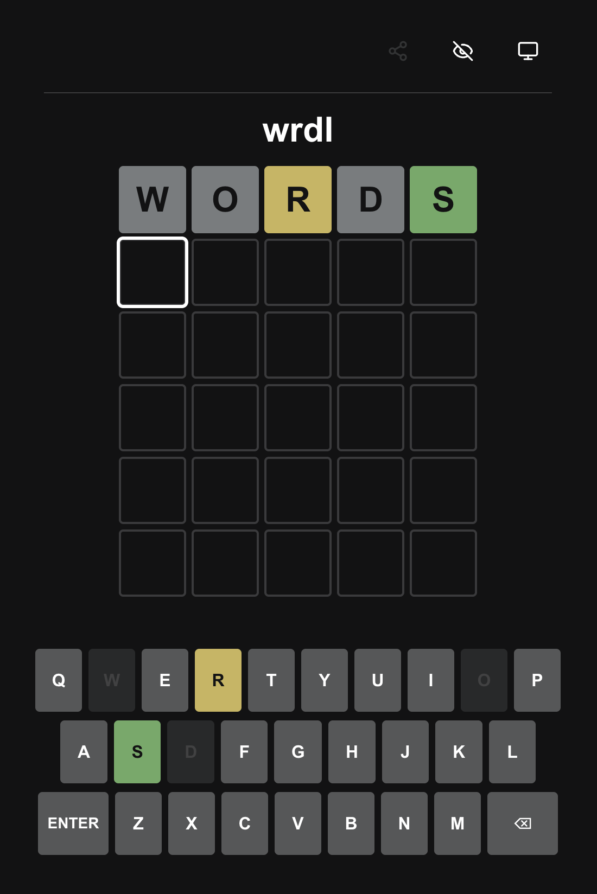

# wrdl

wrdl is a [Wordle](https://www.nytimes.com/games/wordle/index.html) clone built with React and TypeScript. Test your vocabulary skills by guessing a 5-letter word in 6 tries or less!



## Features

- **Classic Wordle gameplay** - Guess the 5-letter word with color-coded feedback
- **Theme options** - Light, dark, and system theme support
- **Privacy mode** - Hide the game board to avoid peeking
- **Share results** - Copy your game results to share with friends
- **Keyboard navigation** - Play with your keyboard or the on-screen keyboard
- **Letter navigation** - Navigate to any letter position with left and right arrow keys & modify each letter individually
- **Unlimited rounds** - Play as many rounds as you want with a new word on each page refresh

## How to Play

1. Guess a 5-letter word by typing letters
2. Press Enter to submit your guess
3. Green letters are in the correct position
4. Yellow letters are in the word but in the wrong position
5. Gray letters are not in the word
6. You have 6 attempts to find the correct word

## Development

```bash
# Install dependencies
npm install

# Start development server
npm run dev

# Build for production
npm run build
```

Built with Vite, React, and TypeScript.
